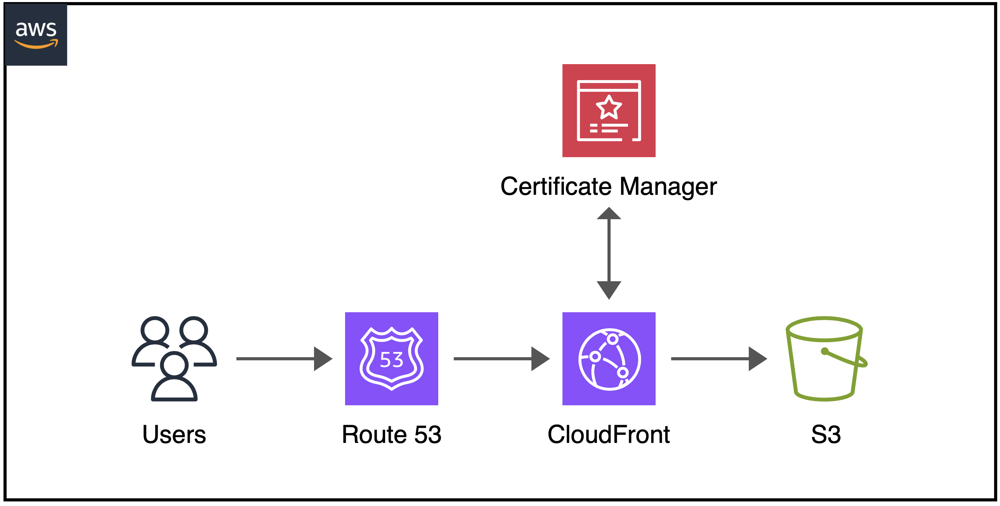

# Build a static page with Route 53, CloudFront and S3 by CDK Python

This pattern shows step-by-step how to build a static page by combination of Amazon Web Services Route 53 Hosted Zone, CloudFront Distribution and S3 Storage.

## Architecture 


## Requirements
* **A domain name** (registered from AWS or other DNS providers).
* **Python version >=3.9** (installed and configured).
* **AWS account** (The IAM user must have sufficient permissions to make necessary AWS service calls and manage AWS resources).
* [**AWS Cloud Development Kit**](https://docs.aws.amazon.com/cdk/latest/guide/cli.html) (AWS CDK Python installed).

## Prepare Route 53 hosted Zone and ACM certificate on AWS Management Console
   - Create Hosted Zone under your domain name.
   - Record all four servers listed for **name servers**.
   - Go to your domain registrar and do the following:
     - Create a new DNS record with **NS** type for your domain.
     - Update the name servers for the domain to use the four Route 53 name servers.
   - When the DNS validation is successful and the certificate is created in ACM that means all are ready for the deployment.

## Deployment Instructions

1. Create working directory for the project to your local working directory.
    ```
    mkdir cdk-staticweb
    ```
2. Change the working directory to this pattern's directory.
    ```
    cd cdk-staticweb
    ```
3. Deploy the stack to your default AWS account and region.
    ```
    cdk deploy
    ```
## Checking and Testing

1. Enter your domain name URL into your browser, you should receive a static page in web browser.

## Cleanup

- Run the given command to delete the resources that were created. It might take some time for the CloudFormation stack to get deleted.
    ```
    cdk destroy
    ```
- Manually delete your-domain.com bucket.
- Manually delete hosted zone and domain certificate.
